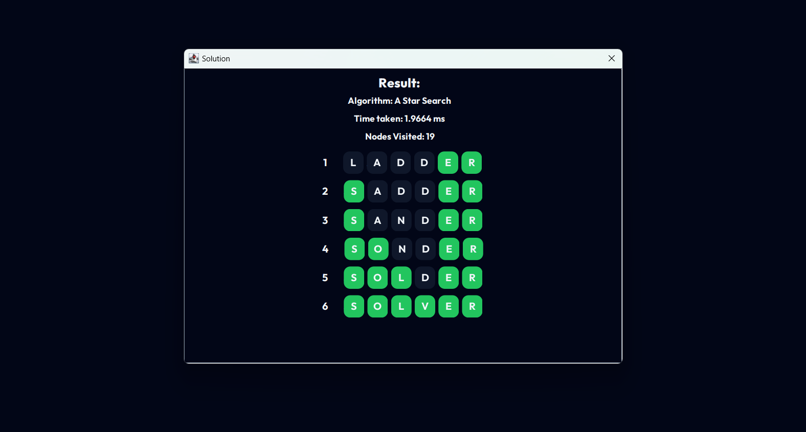

# Tucil 3

## 🛸 Project Overview
This project contains the implementation of Uniform Cost Search, Greedy Best First Search, and A Star (A*) algorithm to solve a game called world ladders. The 
https://wordwormdormdork.com/

## 🤵🏻 Contributors
- 13522084 Dhafin Fawwaz Ikramullah

## 📝 Requirements
* Java: make sure java is installed in your device to run the project.

## 🖼️ Screenshots

| Class                      | Screenshot            |
| -------------------------  | --------------------- |
| Main Menu.                 |        |
| Example Result.            |        |

## Preprocess
Before running the project, the dictionary must be preprocessed first into binary format. You can skip this step if you want to use the prebuilt one
### Compile Preprocess
Run the following command to compile the preprocess
```
./compilepreprocess.bat
```
or
```
javac -d bin ./src/PreProcess.java -cp ./src
```

### Run Preprocess
Run the following command to preprocess the choosen dictionary
```
./runpreprocess.bat
```
or
```
java -cp bin PreProcess -p <path to dictionary.txt> <path to binary result>
```
for example
```
java -cp bin PreProcess -p ./src/Asset/dictionary.txt ./src/Asset/dictionary.bin
```

## GUI
### Compile & Run GUI
Run the following command to compile and run the GUI
```
./compilerun.bat
```
or
```
javac -d bin ./src/Main.java -cp ./src
java -XX:CompileThreshold=1 -cp bin Main
```

### Run GUI
Run the following command to compile and run the GUI. Make sure its already compiled
```
./run.bat
```
or
```
java -XX:CompileThreshold=1 -cp bin Main
```


## Test Case Runner
### Running Test Case
You can use the TestCaseRunner to run multiple test case easily. Use the following command
```
./compileruntest.bat
```
or
```
java -XX:CompileThreshold=1 -cp bin TestCaseRunner <input file path> <dictionary file path>
```
For example
```
java -XX:CompileThreshold=1 -cp bin TestCaseRunner ./test/input.txt ./src/Asset/dictionary.bin
```
You can see example of the input format in `./test/input.txt` and the output in `./test/output.txt`

### Writing Test Case to File
To write test case result in file, use pipe like the following
```
./compileruntest.bat > test/output.txt
```
or
```
java -XX:CompileThreshold=1 -cp bin TestCaseRunner ./test/input.txt ./src/Asset/dictionary.bin > ./test/output.txt
```


## Tips
you can also replace the dictionary by replacing the file in `Asset/dictionary.txt`

